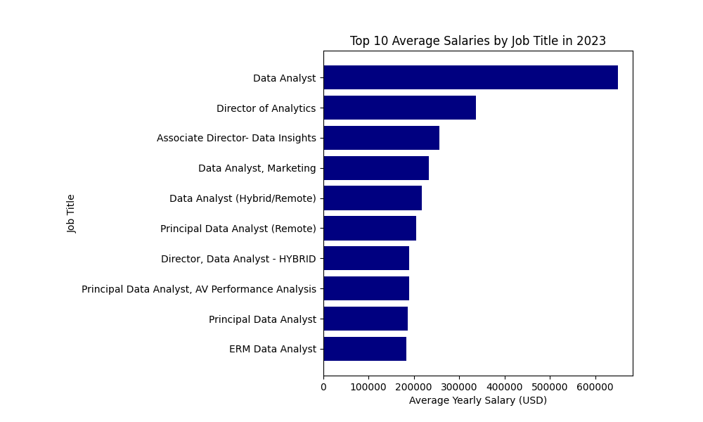
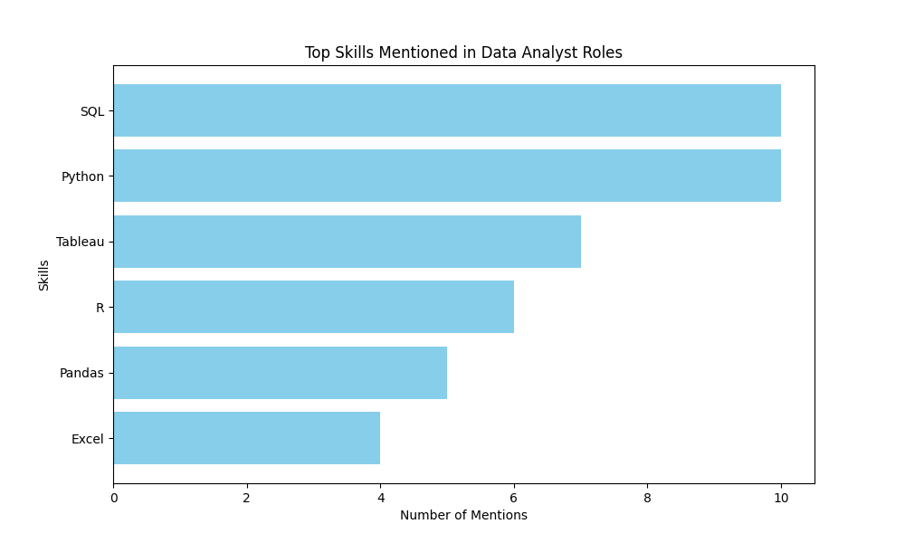

# INTRODUCTION
This project focuses on 2023 job postings and trying to pull 'Data Analyst' specific insights such as top-paying companys, job skills, in-demand skills, and where high demands meets high salary. 

The SQL Queries developed can be found here: [project_sql folder](/project_sql/)

# BACKGROUND
The project was developed when going through Luke Barousse & Kelly Adam's Data Analytics Course to further hone my SQL skills. The database used for this project was pulled from the following [SQL COURSE](https://lukebarousse.com/sql).  

# TOOLS I LEARNED & USED

- **SQL:** The powerhouse of this project allowing me to query the database & develop my own insights on the jobs I am interested in. 

- **PostgreSQL:** The database management system that most analysts and scientist prefer. 

- **VSCODE:** Personally, the most comfortable IDE to develop SQL and Python queries and scripts.

- **GIT & GitHub:** The go-to version control and sharing platform to showcase my analysis and share my work.

- **ChatGPT 3.5:** To keep with new technology, I like to explore what they can do. Therefore, I sometimes prompt AI to help me learn new subjects and automate repetitive tasks, increasing my productivity. Of course, I double check its' outputs as well. 

# THE ANALYSIS
Each of the queries were created to answer a question to help me understand the market and continue my job search with more confidence. 

### 1. What are the top-paying data analyst jobs? [Top-Paying Jobs Query](/project_sql/1_top_paying_jobs.sql)
Initially, this query was to identify the highest paying Data Analyst jobs and which companies provided them. Then, to further personalize I filtered by the job location, to focus on remote/close companies. 

```sql
-- Highest Paying Data Analyst Jobs - Remote/Close By
SELECT 
    job_id,
    job_title,
    job_location, 
    job_schedule_type,
    salary_year_avg, 
    job_posted_date,
    name AS company_name
FROM
    job_postings_fact
LEFT JOIN company_dim
    ON job_postings_fact.company_id = company_dim.company_id
WHERE job_title_short = 'Data Analyst' 
    AND (job_location = 'Anywhere' OR job_location = 'Denver, CO')
    AND salary_year_avg IS NOT NULL
ORDER BY salary_year_avg DESC
LIMIT 50;
```
To better visualize the salaries of the top 10 jobs, I created a chart using this Python script: [Top-Paying Jobs Viz](/project_sql/2_top_paying_job_skills.py)

```python
import pandas as pd
import matplotlib.pyplot as plt
from io import StringIO

# CSV data exported from SQL query
csv_data = '''
"job_id","job_title","job_location","job_schedule_type","salary_year_avg","job_posted_date","company_name"
226942,"Data Analyst","Anywhere","Full-time","650000.0","2023-02-20 15:13:33","Mantys"
547382,"Director of Analytics","Anywhere","Full-time","336500.0","2023-08-23 12:04:42","Meta"
552322,"Associate Director- Data Insights","Anywhere","Full-time","255829.5","2023-06-18 16:03:12","AT&T"
99305,"Data Analyst, Marketing","Anywhere","Full-time","232423.0","2023-12-05 20:00:40","Pinterest Job Advertisements"
1021647,"Data Analyst (Hybrid/Remote)","Anywhere","Full-time","217000.0","2023-01-17 00:17:23","Uclahealthcareers"
168310,"Principal Data Analyst (Remote)","Anywhere","Full-time","205000.0","2023-08-09 11:00:01","SmartAsset"
731368,"Director, Data Analyst - HYBRID","Anywhere","Full-time","189309.0","2023-12-07 15:00:13","Inclusively"
310660,"Principal Data Analyst, AV Performance Analysis","Anywhere","Full-time","189000.0","2023-01-05 00:00:25","Motional"
1749593,"Principal Data Analyst","Anywhere","Full-time","186000.0","2023-07-11 16:00:05","SmartAsset"
387860,"ERM Data Analyst","Anywhere","Full-time","184000.0","2023-06-09 08:01:04","Get It Recruit - Information Technology"
'''

# Load CSV data into a DataFrame
df = pd.read_csv(StringIO(csv_data))

# Extract job titles and corresponding average salaries
titles = df['job_title'].head(10)
salaries = df['salary_year_avg'].head(10)

# Plotting the chart
plt.figure(figsize=(10, 6))
plt.barh(titles, salaries, color='navy')
plt.title('Top 10 Average Salaries by Job Title in 2023')
plt.ylabel('Job Title')
plt.xlabel('Average Yearly Salary (USD)')
plt.gca().invert_yaxis()  # Invert y-axis to display highest salary at the top
plt.show()
```



This query clearly paints the pay range Data Analyst has. Also, the simple job title of 'Data Analyst' does not always mean entry level. Additionally, whilst working on this query another question came up as to which companies offered the most remote Data Analyst oppurtunities. 

```sql
-- Count of Companies Hiring Remote Data Analyst
SELECT 
    name AS company_name,
    COUNT(company_dim.name) AS number_of_postings,
    ROUND(AVG(salary_year_avg)) AS avg_salary 
FROM
    job_postings_fact
LEFT JOIN company_dim
    ON job_postings_fact.company_id = company_dim.company_id
WHERE job_title_short = 'Data Analyst' 
    AND (job_location = 'Anywhere')
    AND salary_year_avg IS NOT NULL
GROUP BY company_dim.name
ORDER BY number_of_postings DESC, avg_salary DESC
LIMIT 50;
```

| Company Name                          | Number of Postings | Average Salary |
|---------------------------------------|--------------------|----------------|
| Get It Recruit - Information Technology | 131                | 86,962         |
| Insight Global                        | 20                 | 90,168         |
| Get It Recruit - Finance              | 18                 | 91,188         |
| Get It Recruit - Healthcare           | 16                 | 89,499         |
| Robert Half                          | 12                 | 122,167        |
| Patterned Learning AI                | 12                 | 81,667         |
| Motion Recruitment                    | 8                  | 107,813        |
| Get It Recruit - Transportation      | 8                  | 77,813         |
| CVS Health                           | 7                  | 91,300         |
| Get It Recruit - Administrative      | 7                  | 65,071         |

Top 10 Companies Offering Remote Data Analysts Positions 

As a result of the second query, I was able to find out that Get It Recruit (An automated job posting system) had the most postings compared to the other companies. However, since this is a job board this means that the database is missing the actual companies that are hiring using Get It Recruit. Hence, I focused on the other companies to see their Remote Data Analyst positions. 

### 2. What skills are required for the top-paying data analyst jobs? [Top-Paying Job Skills Query](/project_sql/2_top_paying_job_skills.sql)
To get a better picture of what the top paying data analyst need to know, I turned the last query results into an common table expression and queried it. Since I wanted to know the skills needed, I had to join two tables on the skill_id. 

```sql 
WITH top_paying_jobs AS (
    SELECT 
        job_id,
        job_title,
        salary_year_avg, 
        name AS company_name
    FROM
        job_postings_fact
    LEFT JOIN company_dim
        ON job_postings_fact.company_id = company_dim.company_id
    WHERE job_title_short = 'Data Analyst' 
        AND (job_location = 'Anywhere' OR job_location = 'Denver, CO')
        AND salary_year_avg IS NOT NULL
    ORDER BY salary_year_avg DESC
    LIMIT 10
)


SELECT top_paying_jobs.*, skills
FROM top_paying_jobs 
INNER JOIN skills_job_dim ON top_paying_jobs.job_id = skills_job_dim.job_id
INNER JOIN skills_dim ON skills_dim.skill_id = skills_job_dim.skill_id
ORDER BY salary_year_avg DESC;
```
To get a better picture of the skills for the top paying jobs, I passed the query results through CHATGPT to have it visualize for me. Unfortunately, ChatGPT 3.5 can only provide python scripts, therefore, I took the script it gave and ran it in VScode. Below is the resultant chart. 


Top Skills Mentions in Data Analyst Roles

From the chart, it is easier to see that the top two skills I need to focus on are SQL and Python. 

### 3 What are the most in-demand skills for Remote Data Analysts? [Most In-Demand Skills Query](/project_sql/3_top_demand_skills.sql)
To get a better understanding of the necessary skills for remote Data Analyst in generally, I used this query. In the sql file, it has 2 methods coming to the same results. The first method, was my first iteration and it was repetitive and confusing to review. Therefore, method 2 is a more efficient query that is easier to review. 

```sql
SELECT skills, 
    count(skills_job_dim.job_id) AS demand_count
FROM job_postings_fact 
INNER JOIN skills_job_dim ON job_postings_fact.job_id = skills_job_dim.job_id
INNER JOIN skills_dim ON skills_dim.skill_id = skills_job_dim.skill_id
WHERE job_title_short = 'Data Analyst'
    AND job_work_from_home = TRUE
GROUP BY skills
ORDER BY demand_count DESC
LIMIT 5;
```

The results of this shows that SQL, Excel, Python, and Tableau are the most soughtafter skills that a remote Data Analyst should have.

### 4. What are the top skills based on salary? [Top-Paying Skills Query](/project_sql/4_top_paying_skills.sql)
By pairing the job posting's average salary and the skills associated with it, I can see the top skills based on salary. 

```sql
SELECT skills, 
    ROUND(avg(salary_year_avg)) AS avg_salary
FROM job_postings_fact 
INNER JOIN skills_job_dim ON job_postings_fact.job_id = skills_job_dim.job_id
INNER JOIN skills_dim ON skills_dim.skill_id = skills_job_dim.skill_id
WHERE job_title_short = 'Data Analyst'
    AND job_work_from_home = TRUE
    AND salary_year_avg IS NOT NULL
GROUP BY skills
ORDER BY avg_salary DESC
LIMIT 25;
```

| Skills          | Average Salary |
|-----------------|----------------|
| pyspark         | 208,172        |
| bitbucket       | 189,155        |
| couchbase       | 160,515        |
| watson          | 160,515        |
| datarobot       | 155,486        |
| gitlab          | 154,500        |
| swift           | 153,750        |
| jupyter         | 152,777        |
| pandas          | 151,821        |
| elasticsearch  | 145,000        |
| golang          | 145,000        |
| numpy           | 143,513        |
| databricks      | 141,907        |
| linux           | 136,508        |
| kubernetes      | 132,500        |
| atlassian       | 131,162        |
| twilio          | 127,000        |
| airflow         | 126,103        |
| scikit-learn    | 125,781        |
| jenkins         | 125,436        |
| notion          |
Table of the Most High-Paying Skills

The results for this was interesting as the top paying skills were not the ones I have generally seen. Pyspark, bitbucket, couchbase, and watson were the top 4. After consulting ChatGPT as to what these were, I learned that they are tools for big data processing, version control, database management, and artificial intelligence. Which would coincide with more senior roles but require making more decisions with data. 

### 5. What are the most optimal skills to learn (aka high in demand and high-paying) [Optimal Skills to Learn](/project_sql/5_optimal_skills.sql)
Intrigued by the results of the last query, I wanted to see the most in-demand and high-paying skills. 

```sql
SELECT 
    skills_dim.skill_id,
    skills_dim.skills, 
    COUNT(skills_job_dim.job_id) AS demand_count,
    ROUND(AVG(job_postings_fact.salary_year_avg)) AS avg_salary
FROM
    job_postings_fact
INNER JOIN skills_job_dim ON job_postings_fact.job_id = skills_job_dim.job_id
INNER JOIN skills_dim ON skills_dim.skill_id = skills_job_dim.skill_id
WHERE job_title_short = 'Data Analyst'
    AND job_work_from_home = TRUE
    AND salary_year_avg IS NOT NULL
GROUP BY skills_dim.skill_id
HAVING COUNT(skills_job_dim.job_id) > 10
ORDER BY 
    avg_salary DESC,
    demand_count DESC
LIMIT 25; 
```
| Skill_id | Skills | Demand Count | Average Salary ($) |
| -------- | ------- | ------- | ------- |
| 8 | go | 27 | 115320 |
| 234 | confluence | 11 | 114210 |
| 97| hadoop | 22 | 113193 |
| 80 | snowflake | 37 | 112948 |
| 74 | azure | 34 | 111225 |
| 77 | bigquery | 13 | 109654 |
| 76 | aws | 32 | 108317 |

Table of most optimal skills sorted by salary. 

Similarly to questions 3 & 4, I have 2 methods for this query and utilized ChatGPT to help understand the types of skills shown. 

- **Cloud Tools and Technologies:** With Snowflake, AWS, and BigQuery being in the top 7 sorted by salary and having fairly high counts, I can see the growing importance of cloud platforms and big data. 

- **Programming Languages:** With Python and R having counts of 236 and 148 whilst staying above a salary of $101k, these languages are truly high demand and proficiency with them is valued. 
 

# WHAT I LEARNED 
Embarking on this project marked my initiation into substantial SQL querying and data analysis, providing me with a comprehensive learning experience beyond the realm of SQL alone.

- **Advanced SQL Techniques:** Through the implementation of intricate SQL functionalities such as JOIN, WITH clauses, and subqueries/CTEs, I honed my ability to craft sophisticated queries aimed at extracting actionable insights from complex datasets.

- **Data Aggregation Mastery:** Consistent utilization of GROUP BY clauses enabled me to delve deeper into the mechanics of aggregate functions like COUNT() and AVG(), empowering me to derive meaningful conclusions from aggregated data.

- **Matplotlib Visualization Integration:** Leveraging my existing Python proficiency, I seamlessly integrated Matplotlib visualizations into my analysis, enhancing the clarity and effectiveness of my storytelling.

- **CHATGPT as a Learning Aid:** Purposefully leveraging ChatGPT as a productivity enhancer, I gleaned valuable insights into best practices, further augmenting my learning journey.

# CONCLUSION

The successful completion of this project marks a significant milestone in my journey, furnishing me with invaluable insights into the job market landscape and equipping me with essential skills requisite for competitive candidacy.

Through the culmination of diverse queries, I've identified key areas for skill enhancement, particularly emphasizing the need to fortify my proficiency in SQL, Python, and Tableau, which are indispensable for aspiring Data Analysts. I intentionally chose to prioritize skill sets relevant to mid-level positions, recognizing the alignment with my current career trajectory.

Moreover, discerning the prevalence of Data Analyst roles within the technology and healthcare sectors, I'm encouraged by the prospects within the tech industry, aligning with my personal preferences and career aspirations. This newfound clarity instills optimism in navigating the intricacies of the competitive job market more strategically.

Furthermore, this project catapulted me into a profound understanding of SQL, PostgreSQL, and VSCode, fostering a deeper appreciation for their utility in driving meaningful insights. Integrating my pre-existing Python expertise and leveraging ChatGPT as a supplementary learning resource served as pivotal elements in elevating the project's efficacy and my overall learning experience.  